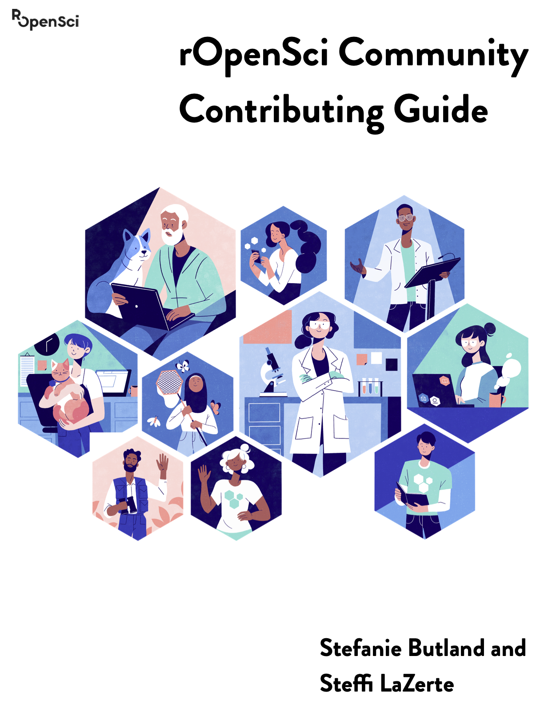

--- 
title: "rOpenSci Community Contributing Guide"
author: "Stefanie Butland and Steffi LaZerte"
date: "`r Sys.Date()`"
site: bookdown::bookdown_site
documentclass: book
bibliography: [book.bib, packages.bib]
biblio-style: apalike
link-citations: yes
description: "A guide to help people find ways to contribute to rOpenSci"
github-repo: ropensci-org/contributing-guidance
url: 'https\://contributing.ropensci.org/'
apple-touch-icon: "favicon/apple-touch-icon.png"
apple-touch-icon-size: 120
favicon: "favicon/favicon.ico"
cover-image: images/contrib_guide_cover.png
---

# {-}

```{r, echo = FALSE, fig.cap="Cover illustration by Lydia Hill"}

citation <- "Stefanie Butland & Steffi LaZerte (2020). ropensci-org/contributing-guidance: Contributing Guide v0.1.0. http://doi.org/10.5281/zenodo.4000531"
```

*Cover illustration by [Lydia Hill](https://www.lydiakahill.com/)*


<a href="https://doi.org/10.5281/zenodo.4000531"></a>

<a rel="license" href="https://creativecommons.org/licenses/by-nc-sa/3.0/us/"></a><br /> This work is licensed under [a Creative Commons Attribution-NonCommercial-ShareAlike 3.0 United States License](https://creativecommons.org/licenses/by-nc-sa/3.0/us/).

Please cite this guide as: 

`r citation`


```{r include = FALSE, eval = FALSE}
# Check links (adapted from roblog::ro_check_urls)

df <- tibble::tibble(rmds = list.files(pattern = "Rmd", full.names = TRUE),
                     text = purrr::map(rmds, ~try(readLines(.), silent = TRUE)),
                     error_read = inherits(text, "try-error"))

if (any(df$error_read)) {
  stop(glue::glue("The file {df$rmds[df$error_read]} could not be read."))
}

df_check <- df %>%
  dplyr::mutate(urls = purrr::map(text, ~stringr::str_extract_all(., "http[s]*\\:[^ \\)\\]\"\\>]*")),
                urls = purrr:: map(urls, unlist)) %>%
  tidyr::unnest(urls) %>%
  dplyr::select(rmds, urls) %>%
  dplyr::distinct() %>%
  dplyr::mutate(ok = purrr:: map_lgl(urls, crul::ok, verb = "get"))

dplyr::filter(df_check, !ok)
```


