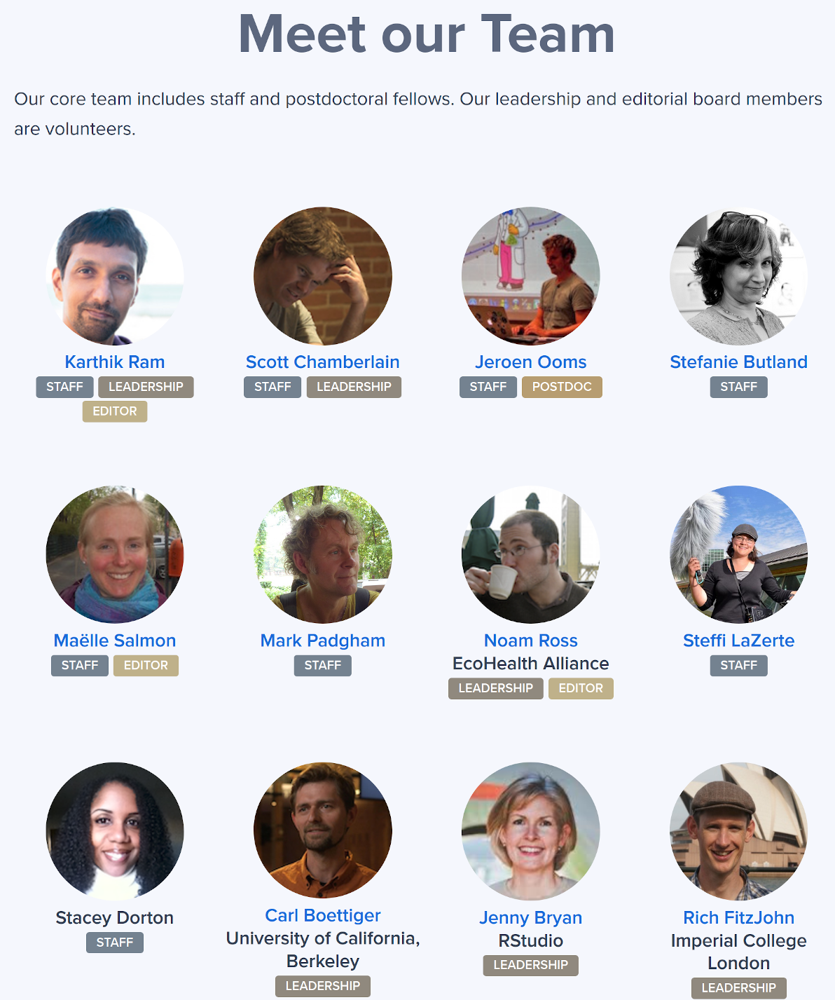
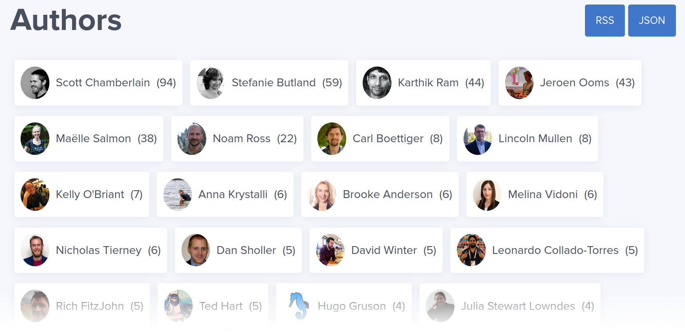
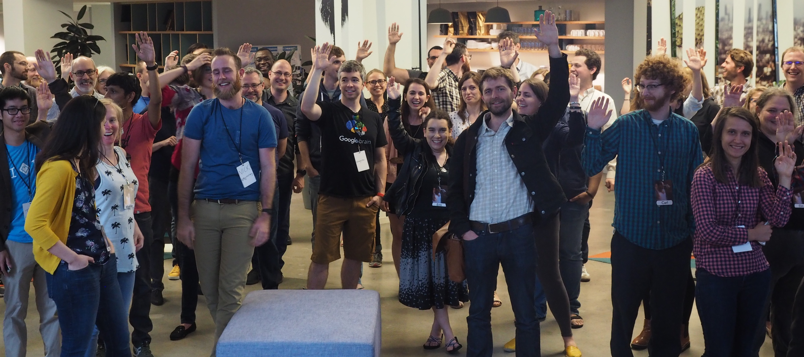

## Our Community {#community}

Our community is our best asset! 
Without the secret sauce that is the Humans of rOpenSci, we’re just a lot of (really good) packages and processes. 
Our community is an ephemeral thing. 
It’s everywhere and nowhere. 
It’s people who believe in our mission and share our values, and have a mindset for learning, improving, and innovating together. 
It's people who prioritize open, reusable, and reproducible research software while also prioritizing creating inclusive spaces through empathy and building trust. 
There are no stupid questions at rOpenSci; everyone appreciates the diversity of expertise and entryways to coding in this thing we love called R.

**The rOpenSci community is a self-identifying group** composed of users and developers of R software tools who, together, contribute to the technical and social infrastructure for open and reproducible research. 
Our specific focus is on software and best practices that lower the barriers to working with scientific data sources. 
Community members are people who use, cite and share use cases for rOpenSci packages, 
attend or present in our Community Calls, write a post for our blog, 
participated in an rOpenSci unconf, or in our research domain focused communities like rOpenSci-Antarctic and Southern Ocean Research, 
answer questions in our fora, actively participate in the life of an rOpenSci project reporting problems and recommending or implementing solutions, 
contribute to, or maintain a package, or participate in rOpenSci peer review as a reviewer, 
author or editor.

Having a diverse community is important to us. 
We welcome anyone dedicated to making their science more open and supporting others in that pursuit, 
no matter their technical expertise, career stage, or work sector.
Further, we welcome people of all backgrounds, including but not limited to any sexuality, 
gender identity, and race. We are anti-racist. 
We recognize that communities are not inclusive by default, particularly as they grow: they require deliberate attention. 
We are all supported by rOpenSci’s Community Manager and a [Code of Conduct](#conduct) that has clear guidelines for behavior and reporting, and is enforced by a committee including rOpenSci staff and an independent community member.

### Humans of rOpenSci {#humans}

In this section we point to groups of people with various formal and informal roles in our community.
This gives some transparency, may help people “recognize themselves” in some roles, 
and provide a foundation to allow folks to reach out to others to learn about making contributions.

rOpenSci was **founded** in 2011 by [Karthik Ram](https://ropensci.org/author/karthik-ram/), [Scott Chamberlain](https://ropensci.org/author/scott-chamberlain/), 
and [Carl Boettiger](https://ropensci.org/author/carl-boettiger/), 
ecologists who were motivated to make scientific data retrieval reproducible.

**Staff** are R users, developers, research software engineers, community builders, 
and an office jedi: [Karthik Ram](https://ropensci.org/author/karthik-ram/), 
[Jeroen Ooms](https://ropensci.org/author/jeroen-ooms/), 
[Maëlle Salmon](https://ropensci.org/author/ma%C3%ABlle-salmon/), 
[Mark Padgham](https://ropensci.org/author/mark-padgham/), 
[Steffi LaZerte](https://ropensci.org/author/steffi-lazerte/), 
and Stacey Dorton.

**Strategic Advisors** [Noam Ross](https://ropensci.org/author/noam-ross/), 
[Carl Boettiger](https://ropensci.org/author/carl-boettiger/), 
[Jenny Bryan](https://ropensci.org/author/jenny-bryan/), and 
[Rich FitzJohn](https://ropensci.org/author/rich-fitzjohn/) volunteer their time.

**Software peer review Editors** [Noam Ross](https://ropensci.org/author/noam-ross/), 
[Karthik Ram](https://ropensci.org/author/karthik-ram/), 
[Maëlle Salmon](https://ropensci.org/author/ma%C3%ABlle-salmon/), 
[Anna Krystalli](https://ropensci.org/author/anna-krystalli/), 
[Melina Vidoni](https://ropensci.org/author/melina-vidoni/), 
[Brooke Anderson](https://ropensci.org/author/brooke-anderson/), 
[Mauro Lepore](https://ropensci.org/author/mauro-lepore/), 
[Laura DeCicco](https://ropensci.org/author/laura-decicco/), and 
[Julia Gustavsen](https://ropensci.org/author/julia-gustavsen/) volunteer their time. 
[Scott Chamberlain](https://ropensci.org/author/scott-chamberlain/) and 
[Lincoln Mullen](https://ropensci.org/author/lincoln-mullen/) are Editor alumni. 
Read posts introducing [Laura DeCicco, Julia Gustavsen, Mauro Lepore](https://ropensci.org/blog/2020/10/27/editors2020/), 
[Brooke Anderson and Melina Vidoni](https://ropensci.org/blog/2019/01/31/more_editors/), 
and [Anna Krystalli and Lincoln Mullen](https://ropensci.org/blog/2018/06/22/new_editors/).
We occasionally recruit [guest editors](https://devguide.ropensci.org/softwarereviewintro.html#editors-and-reviewers) for some package reviews.

Get to know some of the **more experienced folks in our community** by reading the 
[.Rprofile series of posts](https://ropensci.org/tags/rprofile/) for which 
[Kelly O’Briant](https://ropensci.org/author/kelly-obriant/) interviewed 
[Mara Averick](https://ropensci.org/blog/2017/11/10/rprofile-mara-averick/), 
[Jenny Bryan](https://ropensci.org/blog/2017/12/08/rprofile-jenny-bryan/), 
[Julia Stewart Lowndes](https://ropensci.org/blog/2018/02/09/rprofile-julia-stewart-lowndes/) 
(with assistance from [Sean Kross](https://ropensci.org/author/sean-kross/)), 
[Karthik Ram](https://ropensci.org/blog/2018/01/12/rprofile-karthik-ram/), 
[Noam Ross](https://ropensci.org/blog/2018/04/13/rprofile-noam-ross/), 
[Julia Silge](https://ropensci.org/blog/2018/06/08/rprofile-julia-silge/), and 
[David Smith](https://ropensci.org/blog/2017/10/13/rprofile-david-smith/).

Over [150 people have reviewed](https://devguide.ropensci.org/softwarereviewintro.html#editors-and-reviewers) 135 packages from **803 authors!**

More than 35 people have presented in our Community Calls attended by people in more than 25 countries. 

You can get to know some community members by reading the blog posts and tech notes they’ve written about their packages, their reviewer experiences, the Community Calls they’ve presented in, or their career paths in R. We have an [authors page](https://ropensci.org/author/) on our website that allows you to find these people by name. The authors page does not yet include rOpenSci package authors.

Many of rOpenSci’s tools are developed by practicing scientists and other researchers who foster strong communities among users and developers in their research domains and openly share their expertise in discussions of best practices. 

*   The [Antarctic/Southern Ocean rOpenSci community](https://ropensci.org/blog/2018/11/13/antarctic/) led by [Ben Raymond](https://ropensci.org/author/ben-raymond/), 
[Jess Melbourne-Thomas](https://en.wikipedia.org/wiki/Jessica_Melbourne-Thomas), 
[Sara Labrousse](https://web.whoi.edu/jenouvrier/people/sara-labrousse-2017-present/), 
[Michael Sumner](https://ropensci.org/author/michael-sumner/), and 
[Anton Van de Putte](https://ropensci.org/author/anton-van-de-putte/) aims to strengthen the community of R users and developers in this area of research.
*   Hydrology researchers [Louise Slater](https://ropensci.org/author/louise-slater/), 
[Sam Zipper](https://ropensci.org/author/sam-zipper/),
[Sam Albers](https://ropensci.org/author/sam-albers/), 
[Ilaria Prosdocimi](https://ropensci.org/author/ilaria-prosdocimi/), 
[Claudia Vitolo](https://ropensci.org/author/claudia-vitolo/), and others promote open package development and peer review in their paper 
[Using R in Hydrology](https://doi.org/10.5194/hess-23-2939-2019) and some of them created and maintain the rOpenSci 
[Task View on hydrological data and modeling](https://github.com/ropensci/Hydrology/blob/master/README.md) in which many of the R packages have been peer reviewed through rOpenSci. 
*   Community members who are academic experts in climate and weather ([Brooke Anderson](https://ropensci.org/author/brooke-anderson/)), 
archaeology ([Ben Marwick](https://ropensci.org/author/ben-marwick/)),
transport ([Robin Lovelace](https://ropensci.org/author/robin-lovelace/)), 
hydrology (see above), 
and Antarctic research (see above) highlighted sources of open data for research in their fields and the R tools to access them in [When Field or Lab Work is not an Option - Leveraging Open Data Resources for Remote Research](https://ropensci.org/blog/2020/05/19/covid-19-open-data/)

Many in the rOpenSci community participate in related organizations and communities like
[R-Ladies](https://rladies.org/), 
[The Carpentries](https://carpentries.org/), 
[Latin American R community](https://www.r-consortium.org/blog/2020/07/07/latin-american-communities-and-organizations-at-user2020), 
the [MiR community](https://medium.com/@doritolay/introducing-mir-a-community-for-underrepresented-users-of-r-7560def7d861) for underrepresented minority users of R, 
[AfricaR](https://africa-r.org/), 
and [Bioconductor](https://www.bioconductor.org/).

We believe in giving credit to people for their contributions and sharing our gratitude. 
Our [Thank You, 2019](https://ropensci.org/blog/2019/12/23/thankyou/) post, 
acknowledging individual contributors, is one example of how we do that. 
For package authors participating in software peer review, 
we encourage “[gratitude through semantic metadata](https://ropensci.org/blog/2018/03/16/thanking-reviewers-in-metadata/)” with the option to acknowledge reviewers in the package DESCRIPTION (with reviewers’ consent).  

<!--
Try [https://allcontributors.org/](https://allcontributors.org/) used by [Stats Peer Review book: Contributors](https://ropenscilabs.github.io/statistical-software-peer-review/index.html#contributors), recommended by Mark Padgham. “Recognize All Contributors. Including those that don't push code”. 
-->

### The special case of rOpenSci unconfs {#unconfs}

Between 2014 and 2019 we held in-person hackathon-flavored unconferences - five in the US and four in Australia. 
The “[rOpenSci unconf](https://ropensci.org/blog/2017/06/02/unconf2017/)” became a place where people met, created and developed projects together, and got to know each other. 
You can get a feel for our unconfs by reading blog posts about [the events and projects](https://ropensci.org/tags/unconf/) and by listening to the [Credibly Curious podcast](https://soundcloud.com/crediblycurious/episode-6-oz-unconf) episode recorded during ozunconf18 by [Nick Tierney](https://ropensci.org/author/nicholas-tierney/) and [Saskia Freytag](https://twitter.com/trashystats).
Through these we fostered a community of trust that functions online effectively and [with kindness](https://blogs.scientificamerican.com/observations/open-software-means-kinder-science/). 
Our unconfs empowered many participants to run their own local unconferences, make new projects happen, build new communities, build relationships that led to collaborations and career moves.
Perhaps the biggest impact of rOpenSci unconfs was on peoples’ confidence and their perceptions of the value they each bring to the world of R in open research.

Rest assured, we’re pondering how to continue building this trust network through collaborative online events.

> The rOpenSci model has contributed much hidden skills and relationship infrastructure that has helped #rstats flourish. 
> It's been a delight to participate in this and see people that got a start at an unconf gain confidence and grow into heavyweight community contributors and leaders over the years.
>  
> [Miles McBain on Twitter](https://twitter.com/MilesMcBain/status/1232458838307065858)

> My life took a turn thanks to rOpenSci - the community I was welcomed into there gave me deep friendships, new skills & confidence to get out of my comfort zone. 
> And the #rstats world as a whole is better for rOpenSci’s existence.
>  
> [Jennifer Thompson on Twitter](https://twitter.com/jent103/status/1232460524031545344)

