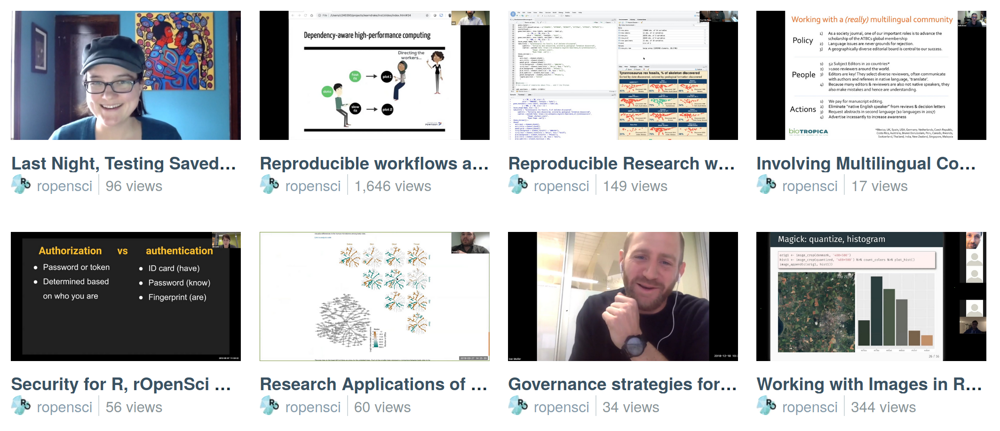
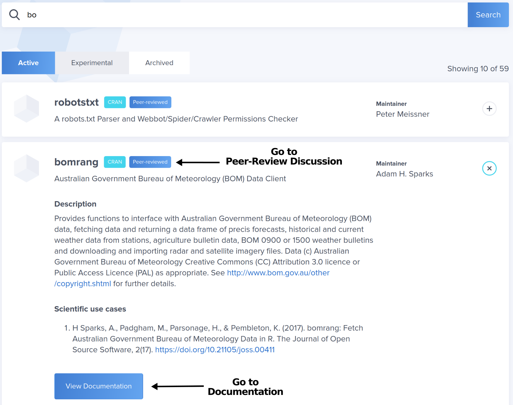
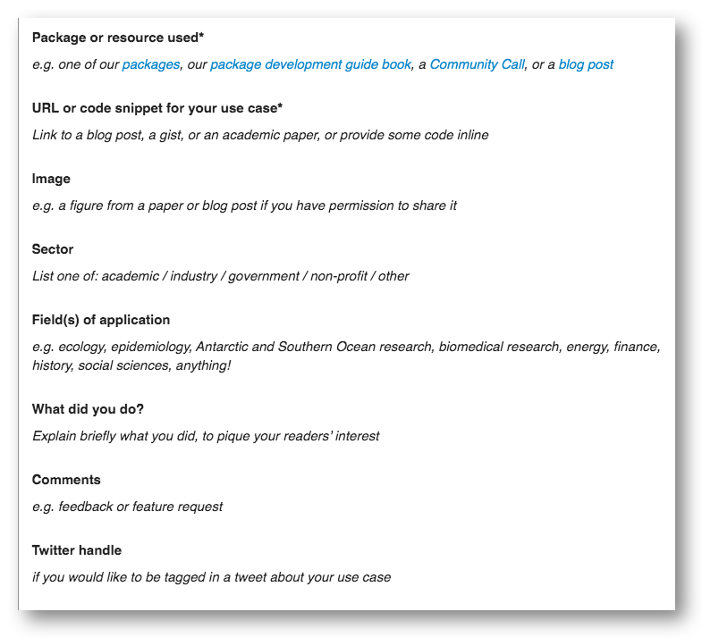
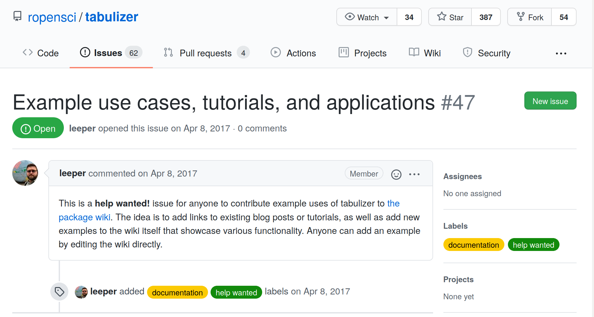
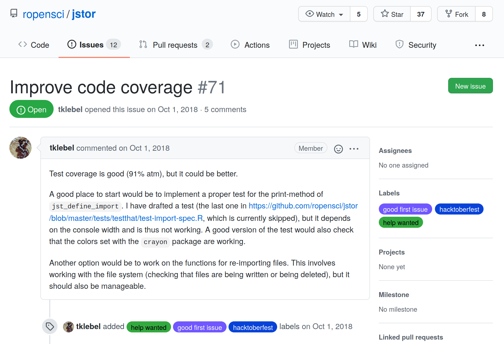

# 3  rOpenSci Resources

Each section of this chapter describes and links to a specific rOpenSci resource with a “How to contribute” list of actions you could take.

Not sure where to get started? Browse [What brings you here?](#motivations) to help you explore what you want to get out of contributing. Categories - [Discover](#discover), [Connect](#connect), [Learn](#learn), [Build](#build), [Help](#help) - each have “I want to” statements followed by examples of specific ways you can contribute. Each example links to a resource in this chapter to help you take action.

## 3.1 Code of Conduct

All participation in rOpenSci activities is supported by a [Code of Conduct](https://ropensci.org/code-of-conduct) that has clear guidelines for reporting and is enforced by a committee including rOpenSci staff and an independent community member.

### 3.1.1 How to contribute?

- **Read our [Code of Conduct](https://ropensci.org/code-of-conduct/)** to ensure you are ready to participate

## 3.2 Communication channels

The [Humans of rOpenSci](#humans) connect and contribute online across many timezones. We carry out our work using multiple channels for one-way and multi-way communications that involve different levels of commitment.

**GitHub** is the platform we use to host our software and documentation projects using Git version control. Our **newsletter**, delivered every two weeks, is the ideal way to stay informed without being overwhelmed by communication channels. We use our public **discussion forum**, **Mastodon**, and **Slack**, each for specific modes of making announcements, promoting contributions from community members, asking and answering questions about rOpenSci packages and recommended best practices, knowledge-sharing and exploration of ideas, as well as more passive learning by “listening” to community wisdom.

The following table lists every communication channel and its purpose. Below that we describe how we use a few specific channels and provide some advice on deciding whether a question you might have is one for rOpenSci or belongs in a more general forum.

| Channel | Purpose |
|:---|:---|
| Website <https://ropensci.org/> <https://github.com/ropensci/roweb3> | Home of rOpenSci |
| [Newsletter](https://ropensci.org/news/) | A digest of R package news, use cases, blog posts, events, curated every two weeks. [Subscribe](https://ropensci.org/news/) via RSS (XML), JSON feed, or email. |
| [Videos](https://vimeo.com/ropensci) | Videos from past Community Calls on Vimeo |
| [Mastodon](https://hachyderm.io/@rOpenSci) | Posts about rOpenSci software, use cases, blog posts, tech notes, events |
| Video conferencing | Community Calls and remote co-working sessions on Zoom |
| [GitHub - ropensci](https://github.com/ropensci) | Mature R packages contributed by rOpenSci staff or community-contributed peer-reviewed packages; software peer review system; rOpenSci website |
| [GitHub - ropenscilabs](https://github.com/ropenscilabs) | Experimental packages and code experiments from staff, collaborators, and participants of unconfs and related events |
| [GitHub - ropensci-org](https://github.com/ropensci-org) | Non-code repositories like this guide, the blog guide, ideas for Community Calls |
| Slack | A semi-open space for communications among people who contribute to rOpenSci |
| Email: info at ropensci dot org | To reach rOpenSci staff when other modes are not suitable |

**GitHub**

The majority of rOpenSci’s work happens on GitHub. In this Guide we use terms like “opening an issue” to refer to tracking ideas, enhancements, tasks, or bugs in a project, and “making a pull request” to submit your proposed fix or new feature. If you’d like some general information on the language and workflow of GitHub, see [Collaborating with issues and pull requests](https://docs.github.com/en/github/collaborating-with-issues-and-pull-requests). To learn about Markdown formatting for interacting with others in issues and pull requests see [Getting started with writing and formatting on GitHub](https://docs.github.com/en/github/writing-on-github/getting-started-with-writing-and-formatting-on-github). For guidance on connecting R to GitHub we recommend Happy Git and GitHub for the useR - <https://happygitwithr.com/>.

**Slack**

We use [Slack](https://slack.com/intl/en-ca/help/articles/115004071768-What-is-Slack-) as a semi-open space for communications among people who have made specific contributions to rOpenSci. These include people who:

- have begun the [software review process for their package](#devguide) (once it’s determined to be in scope)
- are assigned to [review a package](#devguide)
- made significant contributions to rOpenSci, including taking over maintenance of an rOpenSci package
- have written a [blog post or tech note](#blog) that is published on our site
- presented in a [Community Call](#commcalls)
- participated in an [unconf](#unconfs)
- use R in a research domain that rOpenSci is explicitly supporting, such as Antarctic and Southern Ocean Research

People join Slack by invitation from our Community Manager or other staff. If you are eligible, you may contact us via our [contact form](https://ropensci.org/contact/); provide your full name and email address.

The benefit of Slack is the ability to more directly access rOpenSci staff and community members, including some more experienced folks in channels like \#software-review or \#package-maintenance, or to watch for postings in \#jobs. People consider it an easier place to ask questions or explore ideas because while it has over 500 members, it’s not fully “in the open”. [We actively welcome new members](https://ropensci.org/blog/2017/07/18/value-of-welcome/) and ensure that all conversations are collegial.

**How to get help**

There is an etiquette to getting help and asking questions. We focus on using, developing, documenting code and infrastructure, and building community, as they specifically align with [our mission](#mission).

People looking for more general R learning may refer to [RStudio Education](https://education.rstudio.com/) and [The Carpentries](https://carpentries.org/).

Read these posts if you have an R question: [Where to get help with your R question?](https://masalmon.eu/2018/07/22/wheretogethelp/), by Maëlle Salmon; [Getting help in R: do as I say, not as I’ve done](https://sctyner.me/post/2019-2-17-rhelp/), by Samantha Tyner.

If you’re asking for R help, reporting a bug, or requesting a new feature, you’re more likely to succeed if you include a good reproducible example, a “reprex”. There’s a [well-documented package](https://reprex.tidyverse.org/) for that including a video, and an rOpenSci Community Call - [How to Ask Questions so they get Answered! Possibly by Yourself!](https://ropensci.org/commcalls/2017-03-07/), with Jenny Bryan, JD Long, and Scott Chamberlain.

### 3.2.1 How to contribute?

- Read our [Code of Conduct](https://ropensci.org/code-of-conduct/) to ensure you are ready to participate
- **Follow [rOpenSci on Mastodon](https://hachyderm.io/@rOpenSci)**
- **Subscribe to our [Newsletter](https://ropensci.org/news/)**
- **Ask or answer questions**. Participate in discussions on GitHub or on Slack
- **Try a 2-hour [remote co-working session](https://www.cscce.org/2020/02/04/online-co-working-partnerships-are-community-of-practice-in-action/)** with someone in our Slack \#co-working channel

## 3.3 Community Calls

Our [Community Calls](https://ropensci.org/commcalls/) are an ideal way to get familiar with rOpenSci. They give you a feeling for how we blend rigorous expertise and recommendations with a friendly and safe way for all participants - presenters and attendees - to stretch themselves. They’re free and open for anyone to attend, and provide an opportunity to connect with rOpenSci community members around the world. Our session on [Maintaining an R package](https://ropensci.org/commcalls/2020-03-18/) had 90 participants from 18 countries!

We’ve run more than 25 Community Calls since their start in 2015. Topics range widely and include [Reproducible research with R](https://ropensci.org/commcalls/2019-07-30/), [Testing](https://ropensci.org/commcalls/2019-12-05/), [Security for R](https://ropensci.org/commcalls/2019-05-07/), [How do you review code that accompanies a research project or paper?](https://ropensci.org/commcalls/2018-10-16/), [Involving multilingual communities](https://ropensci.org/commcalls/2019-06-28/), [Research applications of rOpenSci taxonomy and biodiversity tools](https://ropensci.org/commcalls/2019-03-27/), [Governance strategies for open source research software projects](https://ropensci.org/commcalls/2018-12-18/) and more!

> There’s nothing like hearing a lively technical banter of experts to pick up the vernacular that one can easily build upon. The first-hand tips and tricks, do’s and don’ts, personal anecdotes of what worked beautifully and what crashed terribly, offered by years of experience are yet unmatched in bringing newbies into speaking the community’s language.\
> [Janani Ravi in “Maintaining an R Package - Community Call Summary”](https://ropensci.org/blog/2020/07/14/commcall-maintaining-pkg/)

These are not your usual webinar. Some calls might involve two to three speakers on a topic, some give an introduction to our tools in a specific research domain followed by several people presenting their use cases for those tools, and some are a moderated discussion among experts. We always leave at least 20 minutes for Q&A. We use collaborative note-taking allowing participants to share their own ideas or resources and to ask and answer questions.

> This live shared document helps everyone … formulate what they would like to say. It also gives people the option to participate without having to … speak up on the call (thus reducing the barrier for people, especially newcomers, to ask questions). The document also gives an opportunity for anyone in the community to share their expertise …\
> [Janani Ravi in “Maintaining an R Package - Community Call Summary”](https://ropensci.org/blog/2020/07/14/commcall-maintaining-pkg/)

Recordings of all past calls are [available online](https://vimeo.com/ropensci), with [closed captions](https://ropensci.org/blog/2020/07/15/subtitles/) (transcript of dialogue visible in text on video) for all calls in 2020 or later.

Examples of community call thumbnails from our Vimeo page

### 3.3.1 How to contribute?

- **Attend a Community Call**. No registration required. Find information about our [next Call](https://ropensci.org/commcalls/).
- **Watch recordings and read collaborative notes from [past Community Calls](https://ropensci.org/commcalls/).**
- Have an idea for a Community Call topic or a speaker to recommend? Have a relevant topic you’re keen to speak about? **Recommend topics or speakers for Community Calls.** Tell us in our public [ideas repository](https://github.com/ropensci-org/community-calls).
- Are you really interested in the topic of an upcoming call? Why not **help organize it?** Contact our Community Manager via our [contact form](https://ropensci.org/contact/).
- Are you enthusiastic about the topic and planning to attend? You might want to **write a summary for our blog**. Contact our Community Manager via our [contact form](https://ropensci.org/contact/).

## 3.4 Social Coworking and Office Hours

Joining a [social coworking and office hours session](https://ropensci.org/blog/2021/08/17/coworking-sessions/) is a great way to interact with other community members as well as to get work done or ask questions.

Coworking is working at the same time, with others, but on different projects. It helps with networking, reduces social isolation, and increases accountability.

These sessions are informal 2hr meetings online, start with introductions and are followed by two 40min coworking sessions, inter spaced with a small break and scavenger hunt. During coworking, you can work quietly in the “Quiet” room, or hangout in the “Noisy” room. There, you can work, chat with others, or ask questions.

Each room has a host, either rOpenSci staff or a Community Host, eager to answer questions about the theme of the month or other projects they’re working on.

**Coworking**:

### 3.4.1 How to contribute?

- **Attend a Coworking session**. No registration required. Find information about our next session on the [Events page](https://ropensci.org/events/).
- Want to **join as a Community Host**? Have some interesting R topics you’d like to talk about and help others with? Contact our Community Manager via our [contact form](https://ropensci.org/contact/).

## 3.5 Blog

The rOpenSci blog contains both long form [blog posts](https://ropensci.org/blog/) and shorter [tech notes](https://ropensci.org/technotes). It’s a large, rich resource for learning about the R packages developed by staff and by community members and how people use them, the people and processes involved in our open software peer review system, and the value people get from being part of our community. We’ve published more than 500 posts since 2012 with more than half written by community members. The long form blog posts are for a broad readership, and the shorter tech notes include information on a software release with major new features, breaking changes, or significant new documentation for example.

This list gives you a taste of some themes. Click on a topic below to see some of our favorite examples.

-  Welcome!
  - [Welcome](https://ropensci.org/tags/welcome/) Posts about the power of welcome and how we do it
-  Interviews
  - [Interviews](https://ropensci.org/tags/interviews/) with rOpenSci staff and experienced community members
-  Summarizing a Community Call
  - [Maintaining an R Package](./blog/2020/07/14/commcall-maintaining-pkg/)
  - [Code Review in the Lab](https://ropensci.org/blog/2018/11/29/codereview/)
-  About a peer-reviewed package
  - [rmangal: Making Ecological Networks Easily Accessible](https://ropensci.org/blog/2019/10/21/rmangal/) talks through the scientific problem and context, shows some code examples, and talks about peer review but doesn’t make that the dominant part of the post.
  - [Forcing Yourself to Make Your Life Easier](https://ropensci.org/blog/2018/04/12/ijtiff/) is an honest post with some reflection and an important message.
  - [All posts tagged with “software peer review”](https://ropensci.org/tags/software-peer-review/)
-  Perspectives from software peer reviewers
  - [Posts tagged with “reviewers”](https://ropensci.org/tags/reviewer/) including some first-time experiences
-  Creative use cases for multiple rOpenSci packages
  - [Getting your toes wet in R: Hydrology, meteorology, and more](https://ropensci.org/blog/2019/04/02/hydrology-task-view/)
  - [The Antarctic/Southern Ocean rOpenSci community](https://ropensci.org/blog/2018/11/13/antarctic/)
  - [4-post series starting with, Where to go observe birds in Radolfzell? An answer with R and open data](https://ropensci.org/tags/birder/)
-  About open data accessible through our packages
  - [When Field or Lab Work is not an Option - Leveraging Open Data Resources for Remote Research](https://ropensci.org/blog/2020/05/19/covid-19-open-data/) with resources highlighted by community experts and the rOpenSci team
-  Using an rOpenSci resource, such as the Package Development Guide or a task view
  - [When Standards Go Wild - Software Review for a Manuscript](https://ropensci.org/blog/2019/04/18/wild-standards/)
  - [Using rOpenSci Software Peer Review Guidelines for Teaching](https://ropensci.org/blog/2019/08/27/software-peer-review-guidelines-for-teaching/)
  - [Getting your toes wet in R: Hydrology, meteorology, and more](https://ropensci.org/blog/2019/04/02/hydrology-task-view/)
-  Major updates to key packages
  - [(Re)introducing skimr v2 - A year in the life of an open source R project](https://ropensci.org/blog/2019/10/29/skimrv2/))
  - [drake transformed](https://ropensci.org/technotes/2019/03/18/drake-700/) (technote)
-  Contributing to or taking over maintenance of a package
  - [Relaunching the qualtRics package](https://ropensci.org/blog/2019/04/30/qualtrics-relaunch/) has an engaging tone while being informative and providing technical details.
  - [Monkeying around with Code and Paying it Forward](https://ropensci.org/blog/2018/04/20/monkeydo/) gives insight into how the author is thinking about workflows and contributing to rOpenSci.
  - [Maintaining an R Package - Community Call Summary](https://ropensci.org/blog/2020/07/14/commcall-maintaining-pkg/)
-  Describe an unsolved problem and a call to action
  - [rOpenSci Educators Collaborative: What Are The Challenges When Teaching Science With R?](https://ropensci.org/tags/educollab/) (3 posts from unconf18)
-  Reproducibility
  - [Posts tagged with “reproducibility”](https://ropensci.org/tags/reproducibility/)
  - [Posts tagged with “reproducible research”](https://ropensci.org/tags/reproducible-research/)
-  About our unconf events and projects
  - [Bringing together people and projects at unconf17](https://ropensci.org/blog/2017/06/02/unconf2017/)
  - [Six tips for running a successful unconference](https://ropensci.org/blog/2017/11/17/unconf-sixtips/)
  - [The value of welcome, part 2: How to prepare 40 new community members for an unconference](https://ropensci.org/blog/2017/12/01/unconf-welcome/)
  - [Sharing the recipe for rOpenSci’s unconf ice breaker](https://ropensci.org/blog/2018/11/01/icebreaker/)
  - [Posts about ozunconf events and projects](https://ropensci.org/tags/ozunconf/)
  - [Posts about all unconf events and projects](https://ropensci.org/tags/unconf/)

There are many ways to explore our blog and tech notes content:

- Search by [tag](https://ropensci.org/tags/)
- Search by [author](https://ropensci.org/author/)
- Search by [date](https://ropensci.org/archive/)
- *ctrl/cmd-f* for a word in [archive page](https://ropensci.org/archive/) of post titles

### 3.5.1 How to contribute?

- **Read [blog posts](https://ropensci.org/blog/) or [tech notes](https://ropensci.org/technotes/)**
- Did you find an article interesting or useful? **Share posts with your network**
- **Comment on a post to share your perspective or to ask a question.** Comments appear in our [public discussion forum](#channels).
- We love to hear stories about how people use our tools and resources. Have an idea for our blog? **Write a blog post or tech note**. Take a look at examples of posts above and on the [blog](https://ropensci.org/blog), browse the [Blog Guide](https://blogguide.ropensci.org/) to see what’s involved, then contact our Community Manager via our [contact form](https://ropensci.org/contact/) to propose and discuss your idea.

## 3.6 Blog Guide

Our [Blog Guide](https://blogguide.ropensci.org/) is written to help authors and editors of rOpenSci blog posts and tech notes to address frequently asked questions, and frequently given suggestions. We created it after reviewing and publishing over 100 posts by community members.

Chapter 1 coaches you in thinking through what you might say in a post and points to examples on different themes. Chapter 2 provides detailed technical guidelines for submitting a post - from drafting in an R Markdown or Markdown template to submitting it for review using GitHub pull request infrastructure. We provide templates, code snippets, our style guide, and checklists to help. One chapter provides some motivation for doing the extra work to contribute a post by outlining what we do to promote it to our large audience. Another outlines how to respond to an editor’s review of your draft post.

### 3.6.1 How to contribute?

- **Write a blog post or tech note**. Read about some [blog themes](#blog), browse the [Blog Guide](https://blogguide.ropensci.org/) to see what’s involved, then contact our Community Manager via our [contact form](https://ropensci.org/contact/) to propose and discuss your idea.
- See a typo or something that’s not clear? **Submit a correction.** Open an issue in [the Blog Guide repository](https://github.com/ropensci-org/blog-guidance) or [make a pull request](#channels-github) with your suggestion and one of the authors will review it. GitHub has helpful [documentation](https://docs.github.com/en/github/collaborating-with-issues-and-pull-requests) for [opening issues](https://docs.github.com/en/github/managing-your-work-on-github/managing-your-work-with-issues) and [making pull requests](https://docs.github.com/en/github/collaborating-with-issues-and-pull-requests/creating-a-pull-request-from-a-fork).

## 3.7 Packages & Docs

The [Packages page](https://ropensci.org/packages/) on our website lists our carefully vetted, staff- and community-contributed R tools that lower barriers to working with open data sources for various research applications. Of over 400 packages, about 30.0% have been peer reviewed, and more than half are on CRAN.

The list is maintained in [our registry](https://github.com/ropensci/roregistry), which contains much more metadata about the packages. Documentation for rOpenSci packages is built and hosted at an automated documentation server ([docs.ropensci.org](https://docs.ropensci.org/); [docs repository](https://github.com/ropensci/docs)).

You can discover packages by searching with a package name, name of the maintainer (maybe you’re a fan of their work), or by keywords in the description such as “taxonomy” or “weather”. Clicking on any package row expands the listing to include a package description and list of academic citations. Clicking on the “View Documentation” Button takes you to the docs page where you can find information on using the package from Getting Started, Articles and Vignettes, and on making contributions from reporting bugs, to submitting feature requests or bug fixes. If present, clicking on the “Peer-reviewed” badge will bring you to the peer-review discussion thread.

Screen shot of packages list showing expanded information on the bomrang package and what to click to access different information

Often the best way to start learning about a package is to install it, and start playing with it. Try some of the examples, maybe on your own data, or with your own use case. You can learn more about how to use a package by reading blog posts and tech notes tagged with package names (like [tesseract](https://ropensci.org/tags/tesseract/) or [taxize](https://ropensci.org/tags/taxize/)). Browse the [tags page](https://ropensci.org/tags/) to find posts. Find examples of how others use them by browsing the [UsesCases category of our public forum](#usecases). Some of our [Community Calls](#commcalls) focus on packages in a specific domain. [Check out our archive](https://ropensci.org/commcalls/) with videos of past calls. Looking for more examples? Ask in the [forum](#channels-forum).

Most developers are interested to hear from you while you’re getting to know a package Is there something unclear in the documentation? Some parts of the software you find confusing? It’s helpful if you share these experiences When possible, use a [reprex](https://reprex.tidyverse.org/articles/reprex-dos-and-donts.html)“, a reproducible example.

While package maintainers have the ultimate say on package features, they are often eager to modify a package to accommodate real world use cases If you have a particular feature request in mind, open an issue in the package repository with a succinct idea, and ideally a minimal [reproducible example](https://reprex.tidyverse.org/articles/reprex-dos-and-donts.html) if code is applicable Avoid emailing maintainers directly - it may be tempting but benefits no one else For some, it’s a challenge to have the confidence to make your suggestion in the open, but taking that step can help others This also helps maintainers manage their work by keeping communications within the GitHub infrastructure that houses the package.

You can also help out by addressing issues (see the [Issues List](#issues)), or making pull requests to add features, fix bugs, add documentation, or add vignettes or articles To do so, take a look at the project’s contributing guide (here’s a [nice example](https://gist.github.com/peterdesmet/e90a1b0dc17af6c12daf6e8b2f044e7c) from [Peter Desmet](https://ropensci.org/author/peter-desmet/), and [another](https://github.com/ecohealthalliance/fasterize/blob/master/CONTRIBUTING.md) from [Noam Ross](https://ropensci.org/author/noam-ross/)), then open an issue to discuss your approach with the author Create a pull request and submit your proposed solution!

### 3.7.1 How to contribute?

- **Browse rOpenSci [packages](https://ropensci.org/packages/)**
- **Browse package [Task Views](#taskviews)**
- **Use an rOpenSci package** (Yes, that is a contribution!)
- **Tell a friend about an rOpenSci package that may be useful for their work**
- **Browse citations of rOpenSci packages** to find interesting applications
- **Cite rOpenSci packages in manuscripts and presentations** and **encourage your colleagues to cite software** Manuscript citations will appear on our packages page.

> Just learned that the webchem package was cited in a paper by a group of oncologists It totally made my morning to think that my code might someday contribute a teensy tiny bit to better treatments for cancer.\
> [Eric Scott on Twitter](https://twitter.com/LeafyEricScott/status/1273605411577442304)

- **Write a post about using rOpenSci packages** on your own blog
- [Report a bug by opening an issue](#channels-github). If you’re asking for R help, reporting a bug, or requesting a new feature, you’re more likely to succeed if you include a good [reprex](https://reprex.tidyverse.org/articles/reprex-dos-and-donts.html) (a reproducible example).
- **Review the documentation** and give feedback to the author in [an issue](#channels-github) on any parts that are confusing
- [Make a pull request](#channels-github) to fix a typo or a bug, to add/fix examples, to add/clarify documentation, to add/update a citation file
- [Make a feature request](#channels-github) by opening an issue in a package that’s critical for your work
- **Write a vignette/article for a package**. Contact the package author, preferably in [an issue](#channels-github), to confirm they are receptive, propose your idea, and determine how they will review your contribution.

## 3.8 Task Views

Task views are excellent resources for guidance on which packages are relevant to a certain topic They might list packages under sections like data retrieval, visualization, or analysis Here we list some [task views](https://github.com/topics/task-view) maintained by rOpenSci staff and community members. They contain packages that are on CRAN and/or on GitHub.

You can contribute to task views by looking at the project’s contributing guide, then comment in an issue to discuss your approach with the maintainer Create a pull request and submit your proposed changes! If you have a problem with one of the packages discussed it’s best to use the specific communication channels of that package (e.g., GitHub Issues).

[Taxonomy](https://github.com/ropensci/taxonomy/blob/master/README.md), maintained by Scott Chamberlain, contains information on retrieving and manipulating taxonomic data in R.

[Antarctic and Southern Ocean Science](https://github.com/SCAR/ropensci/blob/master/task_view/README.md), maintained by Ben Raymond, covers a range of topics within the geosciences, life sciences, physical sciences, and humanities and social sciences of particular interest to Antarctic and Southern Ocean researchers.

[Hydrological Data and Modeling](https://github.com/ropensci/Hydrology/blob/master/README.md), maintained by Sam Zipper, Sam Albers, and Ilaria Prosdocimi, contains information about packages broadly relevant to hydrology, defined as the movement, distribution and quality of water and water resources over a broad spatial scale of landscapes The maintainers built on this task view in “[Getting your toes wet in R: Hydrology, meteorology, and more](https://ropensci.org/blog/2019/04/02/hydrology-task-view/)”.

[Archaeological Science](https://github.com/benmarwick/ctv-archaeology/blob/master/README.md), maintained by Ben Marwick, contains packages useful for scientific work in Archaeology, grouped by topic.

[Web Technologies and Services](https://github.com/ropensci/webservices/blob/master/README.md), maintained by Scott Chamberlain, Thomas Leeper, Patrick Mair, Karthik Ram, and Christopher Gandrud, contains information about how to use R and the world wide web together It focuses on packages for obtaining web-based data and information, frameworks for building web-based R applications, and online services that can be accessed from R.

### 3.8.1 How to contribute

- **Browse existing [Task Views](https://github.com/topics/task-view)** to discover packages to use.
- [Make a pull request](#channels-github) to add packages or details to an existing task view after discussing your approach with the maintainer.

## 3.9 Use cases

You can **find use cases** for rOpenSci packages and resources on our [rOpenSci Use Cases page](https://ropensci.org/usecases/).

A “use case” here is a write-up of an example, including an explanation of what you did, some code, and where possible, an image showing an outcome. It might take the form of a code snippet, or a link to a blog post or to an analysis in a public repository.

Many of these use cases include applications in academia, industry, government, or “just for fun” with examples on biodiversity, ecology, text processing, bibliometrics, workflows and reproducibility, weather, public health, bicycle networks, agronomy, epidemiology, surveys, seafood mislabelling, tweets about fires, and others!

Some use cases outline examples of how resources like our [guide on package development, review and maintenance](#devguide) have been used independently of rOpenSci Read more in our blog post, [What are Your Use Cases for rOpenSci Tools and Resources?](https://ropensci.org/blog/2019/10/15/use-cases/)

You can **search or sort by package, title or date** on the [rOpenSci Use Cases page](https://ropensci.org/usecases).

We love it when people share their use cases For so many reasons.

It’s valuable to both users and developers of a package to see how it has been used “in the wild” This goes a long way to encouraging people to maintain their package knowing there are others who appreciate, use, and build on their work This also helps people imagine how they might use a package to address their research question, and provides some code to give them a head-start.

Developers and users will thank you and you’ll get the credit and some visibility for your work!

### 3.9.1 How to contribute

- **Explore use cases** on the [rOpenSci Use Cases page](https://ropensci.org/usecases/). Consider posting or sharing to other platforms if you find them particularly helpful.
- We’ve made it easy to **submit your use cases** for rOpenSci packages (including your own) or resources by creating a template to guide you. When you [post your use case](https://ropensci.org/usecases/) we’ll post to Mastodon about it to rOpenSci’s followers, tagging you and the package or resource author, and we might feature it in our [newsletter](#channels).
- **Encourage your peers to submit use cases**. Over time, these “small” actions are creating valuable open resources!

Screen shot of the use case template

*Use case template*

## 3.10 Issues list

Here we describe how to find and consider working on open issues in rOpenSci projects. In 2019, 117 people made their first-ever code contribution to rOpenSci! The [rOpenSci issues list](https://github.com/search?q=org%3Aropensci+state%3Aopen&type=Issues) is a dynamic search on GitHub showing all open issues in the “rOpenSci GitHub organization”, and the [rOpenSci Help Wanted](https://ropensci.org/help-wanted/) page shows a subset of open issues labelled `help wanted`.

Issues in GitHub are used to track ideas, enhancements, tasks, or bugs. For general information on using issues see the documentation on [Managing your work with issues](https://docs.github.com/en/github/managing-your-work-on-github/managing-your-work-with-issues), and the GitHub Guide [Mastering Issues](https://guides.github.com/features/issues/). Issues can be opened by anyone - the package maintainer, a user reporting a bug or something in the documentation that’s confusing, or a person proposing their idea for contributing. For more sources of information on using GitHub see [Communication channels](#channels-github).

Many of our packages are developed by busy community members working in research environments in which software development is a voluntary, side project. These developers often appreciate help in addressing open issues in their packages. These can involve either code or non-code contributions. Some will be suitable for beginners and some will require more experience. To contribute, see if there is an issue that interests you, take a look at the project’s contributing guide, then comment in the issue to discuss your approach with the maintainer. Once your proposed plan is accepted by the maintainer, create a pull request and submit your solution. Don’t be discouraged if you don’t get an immediate response. It will depend on the popularity of a package and whether maintaining it is part of a person’s “day job”.

The easiest way to look at issues is to **browse all `help wanted` issues** on the [rOpenSci website](https://ropensci.org/help-wanted/).

Alternatively, you can look at **all open issues** in rOpenSci with `org:ropensci state:open` [`https://github.com/search?q=org%3Aropensci++state%3Aopen&type=Issues`](https://github.com/search?q=org%3Aropensci++state%3Aopen&type=Issues)

Try narrowing down your search for open issues by **searching for specific labels**.

- [`help wanted`](https://github.com/search?q=org%3Aropensci+label%3A%22help+wanted%22+state%3Aopen&type=Issues) (GitHub search terms `org:ropensci label:"help wanted" state:open`)
- [`good first issue`](https://github.com/search?q=org%3Aropensci+label%3A%22good+first+issue%22+state%3Aopen&type=Issues) (GitHub search terms `org:ropensci label:"good first issue" state:open`)
- [`documentation`](https://github.com/search?q=org%3Aropensci+label%3A%22documentation%22+state%3Aopen&type=Issues) (GitHub search terms `org:ropensci label:"documentation" state:open`)
- [`feature`](https://github.com/search?q=org%3Aropensci+label%3A%22feature%22+state%3Aopen&type=Issues) (GitHub search terms `org:ropensci label:"feature" state:open`)

You can also combine labels in a search. [For example](https://github.com/search?q=org%3Aropensci+label%3A%22help+wanted%22+label%3A%22good+first+issue%22+state%3Aopen&type=issues), `org:ropensci label:"help wanted" label:"good first issue" state:open`

\
**Remember! Not all issues require coding!**

Screenshot of a Non-coding ‘help wanted’ issue called ‘Example use cases, tutorials, and applications’ from the tabulizer package repository on GitHub

*Non-Coding “help wanted” issue*

Screenshot of a Coding ‘help wanted’ issue called ‘Improve code coverage’ from the jsor package repository on GitHub

*Coding “help wanted” issue*

Are you a package author who wants to encourage people to help with issues in your project? Consider making your packages “[contribution and collaboration friendly](https://devguide.ropensci.org/collaboration.html#friendlyfiles)” by including a [code of conduct](https://devguide.ropensci.org/collaboration.html#code-of-conduct) and a contribution guide.

Some good examples of contribution guides are [this one](https://gist.github.com/peterdesmet/e90a1b0dc17af6c12daf6e8b2f044e7c) from [Peter Desmet](https://ropensci.org/author/peter-desmet/), and [this one](https://github.com/ecohealthalliance/fasterize/blob/master/CONTRIBUTING.md) from [Noam Ross](https://ropensci.org/author/noam-ross/).

You can also label issues as suggested above. We keep track of newly labelled `help wanted` issues and post about them to help developers get help.

### 3.10.1 How to contribute?

- For package authors: **Label your issues** so people interested in contributing can find them. We recommend “help wanted” (no hyphen), “good first issue”, “beginner”
- For package authors: **Include future plans for your package** in the README and open issues to address aspects of your plan.
- **Address a “Help wanted” issue**. Take a look at the [Help Wanted page](https://ropensci.org/help-wanted/). If you see one that interests you, take a look at the project’s contributing guide, then comment in the issue to discuss your approach with the author. Create a [pull request](#channels-github) and submit your solution!
- **Address any open issue.** The majority of [issues](https://github.com/search?q=org%3Aropensci+state%3Aopen&type=Issues) are not labelled “help wanted” but that doesn’t mean the author wouldn’t appreciate your help. Browse the issues in a package you use and see if there’s one you could address. This is a great way to get your favorite packages work the way you want them to!

## 3.11 Dev Guide: Development, maintenance, and peer review of rOpenSci packages

Dev guide book cover in light blue showing assembly line chain of people handling packages in white

Our online guide “[rOpenSci Packages: Development, Maintenance, and Peer Review](https://devguide.ropensci.org/)” a.k.a. the “Dev Guide”, is a resource for authors, maintainers, reviewers and editors of rOpenSci packages.

rOpenSci has been running a software peer review system since 2015 to combine the best of academic peer review with software review. Having robust and reliable software tools is an important component of supporting open science and reproducible research. The Dev Guide was developed as a resource to help support and streamline these efforts and to promote best practices. It contains a huge amount of information including:

- Standards and best practices for building packages, such as [creating and testing packages](https://devguide.ropensci.org/building.html), [continuous integration](https://devguide.ropensci.org/ci.html) and [security](https://devguide.ropensci.org/package-development-security-best-practices.html).
- [The peer review process](https://devguide.ropensci.org/softwarereviewintro.html), including policies and guides for authors and reviewers

Are you wondering **what it’s like to review a package for the first time**, or how long it might take? Explore the Dev Guide sections on [Why submit your package to rOpenSci?](https://devguide.ropensci.org/softwarereviewintro.html#whysubmit) and [Guide for Reviewers](https://devguide.ropensci.org/reviewerguide.html). Read [blog posts with the “reviewer” tag](https://ropensci.org/tags/reviewer/). Many people review an R package before ever making one. Check out the [list of past reviewers](https://devguide.ropensci.org/softwarereviewintro.html#reviewers). Maybe you know one of them and can ask about their experience.

> As a useR, you are qualified as a potential package reviewer if you have some appreciation for what makes your favourite packages useful.\
> *[Miles McBain in “Where is the value in package peer review?”](https://ropensci.org/blog/2018/04/06/peer-review-value/)*

If you’re **interested in submitting a package for peer-review**, read the Dev Guide section [Why review packages for rOpenSci?](https://devguide.ropensci.org/softwarereviewintro.html#whyreview) or read [blog posts with the “software-peer-review” tag](https://ropensci.org/tags/software-peer-review/) to get the perspectives of authors whose packages have passed peer review as well as learn about the process itself.

Once you’ve submitted your package and an editor has assigned reviewers, you and the reviewers will be invited to join rOpenSci’s [Slack](#channels-slack) workspace where you can connect more directly with members of the rOpenSci community, including other reviewers, package authors, users, and the rOpenSci staff and leadership team.

When you submit your package for review, **consider also publishing a journal article about your package**. We have collaborative agreements with two journals. If you choose to submit an article to the [Journal of Open Source Software (JOSS)](https://joss.theoj.org/), it will be [evaluated by JOSS](https://devguide.ropensci.org/guide-for-authors.html) based on the completed rOpenSci review. To submit to [Methods in Ecology and Evolution](https://ropensci.org/blog/2017/11/29/review-collaboration-mee/), you can submit to a joint review process whereby your package is reviewed by rOpenSci, followed by a fast-tracked review of the manuscript by Methods in Ecology and Evolution.

Finally, make sure your package is easily citable to get credit for all your hard work! Use the `use_citation()` function from the usethis package to add a `CITATION` file so users can use `citation("yourpackage")` to easily find how to best cite your package. It’s also useful to add a section to your `README` letting users know how you’d like them to cite your package.

Sometimes an rOpenSci package maintainer finds that maintaining a package is no longer feasible for them. When that happens, we work hard to find new maintainers. If you think you might be interested, the Dev Guide Chapter on [Changing Maintainers](https://devguide.ropensci.org/changing-maintainers.html) is a good place to start. If taking on a whole package seems like a bit much, check out our [“Issues”](#issues) section here to find specific issues you could help tackle in a package.

For the big picture, watch the video of Noam Ross’s useR! 2020 keynote, “[Peer-Reviewing R Code: Where We’ve Been and Where We’re Going at rOpenSci](https://youtu.be/iJnn_9xKkqk)”

Read how our Dev Guide has been used in the wild in a manuscript review: [When Standards Go Wild - Software Review for a Manuscript](https://ropensci.org/blog/2019/04/18/wild-standards/), and in the core curriculum of a Master of Data Science program: [Using rOpenSci Software Peer Review Guidelines for Teaching](https://ropensci.org/blog/2019/08/27/software-peer-review-guidelines-for-teaching/).

### 3.11.1 How to contribute

- **Learn about reviewer guidelines**. Read the [Guide for Reviewers](https://devguide.ropensci.org/reviewerguide.html)
- **Volunteer to review a package**. Fill out [this form to get started](https://airtable.com/shrnfDI2S9uuyxtDw). You’ll be contacted by an editor when a submitted package fits your profile. First-time reviewers are paired with more experienced reviewers and can request guidance from an editor.
- **Submit your package for peer review**. Read the [Guide for Authors](https://devguide.ropensci.org/guide-for-authors.html) and then submit a pre-submission inquiry to the [GitHub repository where reviews take place](https://github.com/ropensci/software-review/issues) to see if your package is in scope for rOpenSci.
- **Publish a paper about your package**. See above for our collaborations with the [Journal of Open Source Software (JOSS)](https://joss.theoj.org/) and [Methods in Ecology and Evolution](https://ropensci.org/blog/2017/11/29/review-collaboration-mee/).
- **Acknowledge your reviewers** in your package DESCRIPTION (with their consent). Read about this in [Thanking Your Reviewers: Gratitude through Semantic Metadata](https://ropensci.org/blog/2018/03/16/thanking-reviewers-in-metadata/).
- Add a CITATION file to **ensure your package is easily citable**
- **Request a co-maintainer for your package**. Post a request in the \#package-maintenance [Slack channel](#channels-Slack).
- **Volunteer to maintain a package**. Check out the [rOpenSci Newsletter](https://ropensci.org/news/), the last section is a “Call For Maintainers” and consists of a list of packages specifically looking for maintainers.

R-Universe logo grey background with white text ‘rOpenSci R-universe’. The O in ‘Open’ is a ringed planet with moons

## 3.12 R-universe

rOpenSci’s [R-universe](https://ropensci.org/r-universe/) is a new platform which launched in 2021 with the aim of improving publication and discovery of R research software.

The R-universe provides three main services.

1.  **Serving packages**

- Anyone can set up a personal R-universe which can build and serve any package hosted on a public git server.
- Pre-building packages simplifies installation of non-CRAN packages
- Articles are also rendered, providing a method for hosting non-software packages, such as research articles bundled as an R package.

2.  **Monitoring software health and activity**

- While still in early development, the goal is to have a system for monitoring software metrics to assess the role and impact of different software.

3.  **Discovery and recommendation**

- The R-universe [front-end dashboard](https://r-universe.dev) cross-links Universes, Maintainers, Articles and different software packages in an effort to increase visibility and help users find new R packages
- A future goal is to be able to offer recommendations to users

### 3.12.1 How to contribute

- [**Explore the R-universe**](https://r-universe.dev) and share your findings with colleagues
- **Create your own R-universe**. See instructions on the [R-universe dashboard](https://r-universe.dev/help/), or check out Jeroen Ooms’ blog post [“How to create your personal CRAN-like repository on R-universe”](https://ropensci.org/blog/2021/06/22/setup-runiverse/) or Yanina Bellini Saibene’s Spanish post [“Creando Tu R-universe”](https://ropensci.org/blog/2021/09/21/creando-tu-r-universe/)
- **Read/Contribute to the [R-universe discussion](https://github.com/r-universe-org/bugs/discussions)**
- [**Report a bug in the R-universe**](https://github.com/r-universe-org/bugs/issues)

## 3.13 Statistical Software Peer Review Book

We invite you to join us in developing new standards for peer-reviewed evaluation of statistical software Learn about this work in progress at [rOpenSci Statistical Software Peer Review](https://stats-devguide.ropensci.org/index.html).

Until recently, rOpenSci’s software peer review program focused on R packages for reproducible data life cycle management To apply these processes to software implementing statistical methods and algorithms, we need new ways of evaluating and testing software, and of managing the review process, and to bring in new expert editors and reviewers This book serves as a home for collecting research and developing those standards, documenting not only our guidelines for statistical software but also the process of expanding the scope of review so the general processes of software review may be adapted and reproduced in other domains.

This work is [supported by the Sloan Foundation](https://ropensci.org/blog/2019/07/15/expanding-software-review/) and is organized under an R Consortium Working Group.

### 3.13.1 How to contribute

- **Read our in-progress book** [rOpenSci Statistical Software Peer Review](https://stats-devguide.ropensci.org/index.html) to familiarize yourself with standards and processes under development
- **Make a suggestion**. We welcome contributions to the project either by filing suggestions as [issues in the book’s GitHub repository](https://github.com/ropenscilabs/statistical-software-peer-review/issues), or by submitting a pull request.
- **Contact us** directly (via [Slack](#channels-slack) or our [contact form](https://ropensci.org/contact/)) to inquire about submitting a statistical software package for pre-review.

## 3.14 Contributing Guide

This book you’re reading right now is the [rOpenSci Community Contributing Guide](https://contributing.ropensci.org/). Its purpose is to welcome you to rOpenSci and help you recognize yourself as a potential contributor. It will help you figure out what you might gain by giving your time, expertise, and experience, match your needs with things that will help rOpenSci’s mission, and connect you with resources to help you along the way.

This Guide is an evolving document and we want people to tell us what’s missing or what’s not clear.

### 3.14.1 How to contribute

- **Submit a typo fix or clarification or tell us what’s missing**. Open an issue in the [GitHub repository for the Guide](https://github.com/ropensci-org/contributing-guidance) to discuss your idea.
- **Contribute something that isn’t addressed in the guide**. Is there something you might like to contribute that isn’t addressed here? Open an issue in the [GitHub repository for the Guide](https://github.com/ropensci-org/contributing-guidance) and/or tag our Community Manager, or ping them on [Slack](#channels-slack) or via our [contact form](https://ropensci.org/contact/) to discuss your idea.
