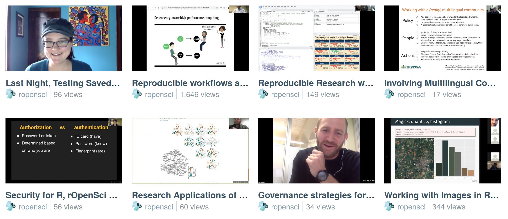

## Community Calls {#commcalls}

Our [Community Calls](https://ropensci.org/commcalls/) are an ideal way to get familiar with rOpenSci.
They give you a feeling for how we blend rigorous expertise and recommendations with a friendly and safe way for all participants - presenters and attendees - to stretch themselves. 
They're free and open for anyone to attend, and provide an opportunity to connect with rOpenSci community members around the world. 
Our session on [Maintaining an R package](https://ropensci.org/commcalls/2020-03-18/) had 90 participants from 18 countries!

We've run more than 25 Community Calls since their start in 2015. 
Topics range widely and include [Reproducible research with R](https://ropensci.org/commcalls/2019-07-30/), 
[Testing](https://ropensci.org/commcalls/2019-12-05/), 
[Security for R](https://ropensci.org/commcalls/2019-05-07/), 
[How do you review code that accompanies a research project or paper?](https://ropensci.org/commcalls/2018-10-16/), 
[Involving multilingual communities](https://ropensci.org/commcalls/2019-06-28/), 
[Research applications of rOpenSci taxonomy and biodiversity tools](https://ropensci.org/commcalls/2019-03-27/), 
[Governance strategies for open source research software projects](https://ropensci.org/commcalls/2018-12-18/) and more!

> There's nothing like hearing a lively technical banter of experts to pick up the vernacular that one can easily build upon. 
> The first-hand tips and tricks, do's and don'ts, personal anecdotes of what worked beautifully and what crashed terribly, 
> offered by years of experience are yet unmatched in bringing newbies into speaking the community's language.
>  
> [Janani Ravi in "Maintaining an R Package - Community Call Summary"](https://ropensci.org/blog/2020/07/14/commcall-maintaining-pkg/)

These are not your usual webinar. 
Some calls might involve two to three speakers on a topic, 
some give an introduction to our tools in a specific research domain followed by several people presenting their use cases for those tools, 
and some are a moderated discussion among experts. 
We always leave at least 20 minutes for Q&A. 
We use collaborative note-taking allowing participants to share their own ideas or resources and to ask and answer questions. 

> This live shared document helps everyone ... formulate what they would like to say. 
> It also gives people the option to participate without having to ... speak up on the call 
> (thus reducing the barrier for people, especially newcomers, to ask questions). 
> The document also gives an opportunity for anyone in the community to share their expertise ...
>  
> [Janani Ravi in "Maintaining an R Package - Community Call Summary"](https://ropensci.org/blog/2020/07/14/commcall-maintaining-pkg/)

Recordings of all past calls are [available online](https://vimeo.com/ropensci), 
with [closed captions](https://ropensci.org/blog/2020/07/15/subtitles/) 
(transcript of dialogue visible in text on video) for all calls in 2020 or later.

<!-- 
To get composite image:
- Go to https://vimeo.com/ropensci
- Using your browsers dev tools, Inspect the element of a video thumbnail
- Set the outermost div (clip__wrapper) which has a width of 50% to 25%
- Change the attribute "padding-left" of the outermost div of the EVEN thumbnails to "padding-right"
- Zoom to the appropriate size
- Use GIMP > Create > Screenshot to take the screen shot
(If Vimeo changes any stylings, this may all change!)
-->

### How to contribute? 

*   **Attend a Community Call**. No registration required. 
    Find information about our [next Call](https://ropensci.org/commcalls/). 
*   **Watch recordings and read collaborative notes from [past Community Calls](https://ropensci.org/commcalls/).**
*   Have an idea for a Community Call topic or a speaker to recommend? 
    Have a relevant topic you're keen to speak about? 
    **Recommend topics or speakers for Community Calls.** 
    Tell us in our public [ideas repository](https://github.com/ropensci-org/community-calls).
*   Are you really interested in the topic of an upcoming call? Why not **help organize it?** 
    Contact our Community Manager via our [contact form](https://ropensci.org/contact/).
*   Are you enthusiastic about the topic and planning to attend? 
    You might want to **write a summary for our blog**. 
    Contact our Community Manager via our [contact form](https://ropensci.org/contact/).

