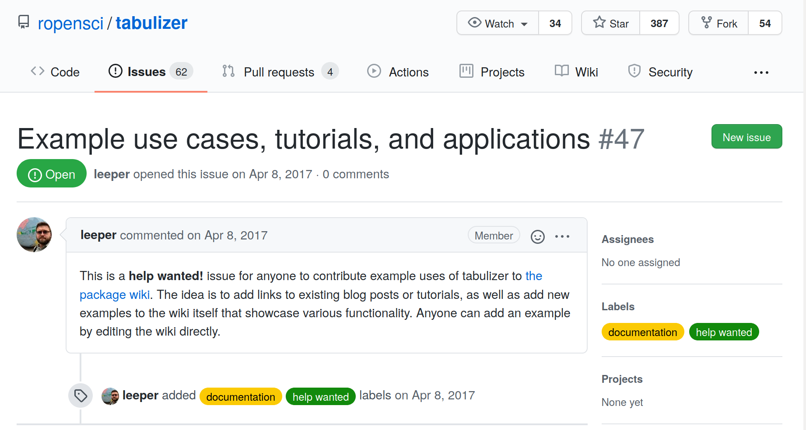
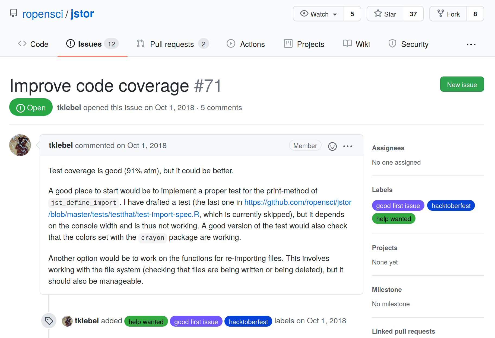

## Issues list {#issues}

Here we describe how to find and consider working on open issues in rOpenSci projects. In 2019, 117 people made their first-ever code contribution to rOpenSci! The [rOpenSci issues list](https://github.com/search?q=org%3Aropensci+state%3Aopen&type=Issues) is a dynamic search on GitHub showing all open issues in the “rOpenSci GitHub organization”, and the [rOpenSci Help Wanted](https://ropensci.org/help-wanted/) page shows a subset of open issues labelled `help wanted`.

Issues in GitHub are used to track ideas, enhancements, tasks, or bugs. For general information on using issues see the documentation on [Managing your work with issues](https://docs.github.com/en/github/managing-your-work-on-github/managing-your-work-with-issues), and the GitHub Guide [Mastering Issues](https://guides.github.com/features/issues/). Issues can be opened by anyone - the package maintainer, a user reporting a bug or something in the documentation that’s confusing, or a person proposing their idea for contributing. For more sources of information on using GitHub see [Communication channels](#channels-github).

Many of our packages are developed by busy community members working in research environments in which software development is a voluntary, side project. These developers often appreciate help in addressing open issues in their packages. These can involve either code or non-code contributions. Some will be suitable for beginners and some will require more experience. To contribute, see if there is an issue that interests you, take a look at the project’s contributing guide, then comment in the issue to discuss your approach with the maintainer. Once your proposed plan is accepted by the maintainer, create a pull request and submit your solution. Don’t be discouraged if you don’t get an immediate response. It will depend on the popularity of a package and whether maintaining it is part of a person’s “day job”. 

The easiest way to look at issues is to **browse all `help wanted` issues** on 
the [rOpenSci website](https://ropensci.org/help-wanted/).

Alternatively, you can look at **all open issues** in rOpenSci with `org:ropensci state:open` [`https://github.com/search?q=org%3Aropensci++state%3Aopen&type=Issues`](https://github.com/search?q=org%3Aropensci++state%3Aopen&type=Issues)

Try narrowing down your search for open issues by **searching for specific labels**.  


*   [`help wanted`](https://github.com/search?q=org%3Aropensci+label%3A%22help+wanted%22+state%3Aopen&type=Issues) (GitHub search terms `org:ropensci label:"help wanted" state:open`)
*   [`good first issue`](https://github.com/search?q=org%3Aropensci+label%3A%22good+first+issue%22+state%3Aopen&type=Issues) (GitHub search terms `org:ropensci label:"good first issue" state:open`)
*   [`documentation`](https://github.com/search?q=org%3Aropensci+label%3A%22documentation%22+state%3Aopen&type=Issues) (GitHub search terms `org:ropensci label:"documentation" state:open`)
*   [`feature`](https://github.com/search?q=org%3Aropensci+label%3A%22feature%22+state%3Aopen&type=Issues) (GitHub search terms `org:ropensci label:"feature" state:open`)

You can also combine labels in a search. [For example](https://github.com/search?q=org%3Aropensci+label%3A%22help+wanted%22+label%3A%22good+first+issue%22+state%3Aopen&type=issues), `org:ropensci label:"help wanted" label:"good first issue" state:open`

<center>
<br>
**Remember! Not all issues require coding!**
</center>

```{r fig.cap = "Screenshot of a Non-coding 'help wanted' issue called 'Example use cases, tutorials, and applications' from the tabulizer package repository on GitHub"}

```

_Non-Coding "help wanted" issue_

```{r fig.cap = "Screenshot of a Coding 'help wanted' issue called 'Improve code coverage' from the jsor package repository on GitHub"}

```

_Coding "help wanted" issue_

Are you a package author who wants to encourage people to help with issues in your project? Consider making your packages “[contribution and collaboration friendly](https://devguide.ropensci.org/collaboration.html#friendlyfiles)” by including a [code of conduct](https://devguide.ropensci.org/collaboration.html#code-of-conduct) and a contribution guide.

Some good examples of contribution guides are [this one](https://gist.github.com/peterdesmet/e90a1b0dc17af6c12daf6e8b2f044e7c) from [Peter Desmet](https://ropensci.org/author/peter-desmet/), and [this one](https://github.com/ecohealthalliance/fasterize/blob/master/CONTRIBUTING.md) from [Noam Ross](https://ropensci.org/author/noam-ross/).

You can also label issues as suggested above. 
We keep track of newly labelled `help wanted` issues and tweet about them to help
developers get help.


### How to contribute? 

*   For package authors: **Label your issues** so people interested in contributing can find them. We recommend “help wanted” (no hyphen), “good first issue”, “beginner”
*   For package authors: **Include future plans for your package** in the README and open issues to address aspects of your plan.
*   **Address a “Help wanted” issue**. Take a look at the [Help Wanted page](https://ropensci.org/help-wanted/). If you see one that interests you, take a look at the project’s contributing guide, then comment in the issue to discuss your approach with the author. Create a [pull request](#channels-github) and submit your solution!
*   **Address any open issue.** The majority of [issues](https://github.com/search?q=org%3Aropensci+state%3Aopen&type=Issues) are not labelled “help wanted” but that doesn’t mean the author wouldn’t appreciate your help. Browse the issues in a package you use and see if there’s one you could address. This is a great way to get your favorite packages work the way you want them to!
