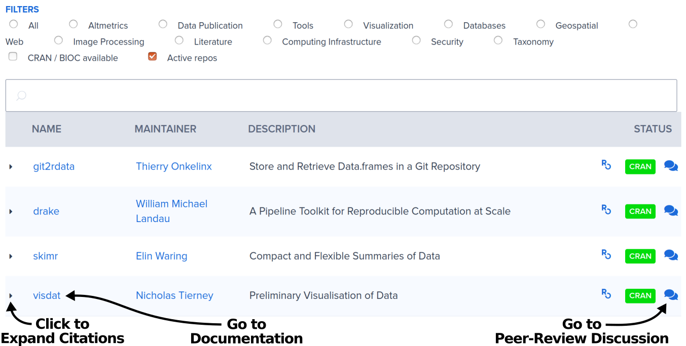
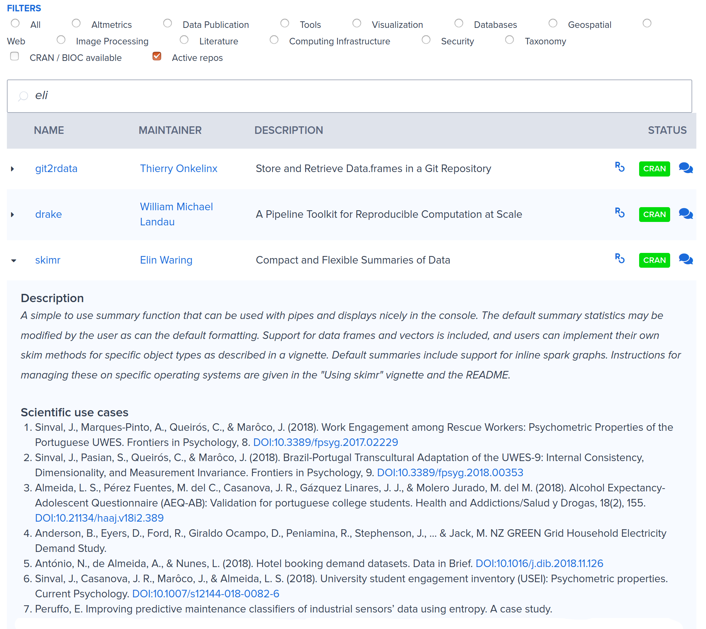

## Packages & Docs {#packages}

The [Packages page](https://ropensci.org/packages/) on our website lists our carefully vetted, staff- and community-contributed R tools that lower barriers to working with open data sources for various research applications. Of over 400 packages, about 30.0% have been peer reviewed, and more than half are on CRAN. 

The list is maintained in [our registry](https://github.com/ropensci/roregistry), which contains much more metadata about the packages. Documentation for rOpenSci packages is built and hosted at an automated documentation server ([docs.ropensci.org](https://docs.ropensci.org/); docs [codebase](https://github.com/ropensci/docs)).

You can discover packages by searching with a package name, name of the maintainer (maybe you’re a fan of their work), or filter by category like “Taxonomy” or “Computing Infrastructure”. For any package, clicking on the package name takes you to its documentation. This docs page is where you can find information on using the package from getting started, Articles and Vignettes, and on making contributions from reporting bugs, to submitting feature requests or bug fixes. 

Clicking on the small arrow to the left of each package name expands the listing to include a package description and list of academic citations:

Often the best way to start learning about a package is to install it, and start playing with it. Try some of the examples, maybe on your own data, or with your own use case. You can learn more about how to use a package by reading blog posts and tech notes tagged with package names (like [tesseract](https://ropensci.org/tags/tesseract/) or [taxize](https://ropensci.org/tags/taxize/)). Browse the [tags page](https://ropensci.org/tags/) to find posts. Find examples of how others use them by browsing the [UsesCases category of our public forum](#usecases). Some of our [Community Calls](#commcalls) focus on packages in a specific domain. [Check out our archive](https://ropensci.org/commcalls/) with videos of past calls. Looking for more examples? Ask in the [forum](#channels-forum). 

Most developers are interested to hear from you while you’re getting to know a package. Is there something unclear in the documentation? Some parts of the software you find confusing? It’s helpful if you share these experiences. When possible, use a “[reprex](https://reprex.tidyverse.org/articles/reprex-dos-and-donts.html)”, a reproducible example.

While package maintainers have the ultimate say on package features, they are often eager to modify a package to accommodate real world use cases. If you have a particular feature request in mind, open an issue in the package repository with a succinct idea, and ideally a minimal [reproducible example](https://reprex.tidyverse.org/articles/reprex-dos-and-donts.html) if code is applicable. Avoid emailing maintainers directly - it may be tempting but benefits no one else. For some, it’s a challenge to have the confidence to make your suggestion in the open, but taking that step can help others. This also helps maintainers manage their work by keeping communications within the GitHub infrastructure that houses the package.

You can also help out by addressing issues (see the [Issues List](#issues)), or making pull requests to add features, fix bugs, add documentation, or add vignettes or articles. To do so, take a look at the project’s contributing guide (here's a [nice CONTRIBUTING.md example](https://gist.github.com/peterdesmet/e90a1b0dc17af6c12daf6e8b2f044e7c) from [Peter Desmet](https://ropensci.org/author/peter-desmet/), and [another good example](https://github.com/ecohealthalliance/fasterize/blob/master/CONTRIBUTING.md) from [Noam Ross](https://ropensci.org/author/noam-ross/)), then open an issue to discuss your approach with the author. Create a pull request and submit your proposed solution!

### How to contribute?

<!-- 
COMMENT:
FOR BROWSING CITATIONS - STEF screenshot "see citations". clicking in pkgs list is the only place to see them I think. MAELLE some work in roweb3 to have a citations page
FOR CITING - STEF we need to decide where to point for citations info. SCOTT if we have a citations page on the new website, the top of that page would be a good place for this. for now maybe give a brief eg? 
-->

*   **Browse rOpenSci [packages](https://ropensci.org/packages/)**
*   **Browse package [Task Views](#taskviews)**
*   **Use an rOpenSci package** (Yes, that is a contribution!)
*   **Tell a friend about an rOpenSci package that may be useful for their work**
*   **Browse citations of rOpenSci packages** to find interesting applications
*   **Cite rOpenSci packages in manuscripts and presentations** and **encourage your colleagues to cite software**. Manuscript citations will appear on our packages page.

> Just learned that the webchem package was cited in a paper by a group of oncologists. It totally made my morning to think that my code might someday contribute a teensy tiny bit to better treatments for cancer.
>  
> [Eric Scott on Twitter](https://twitter.com/LeafyEricScott/status/1273605411577442304) 

*   **Write a post about using rOpenSci packages** on your own blog
*   [Report a bug by opening an issue](#channels-github). If you’re asking for R help, reporting a bug, or requesting a new feature, you’re more likely to succeed if you include a good [reprex](https://reprex.tidyverse.org/articles/reprex-dos-and-donts.html) (a reproducible example).
*   **Review the documentation** and give feedback to the author in [an issue](#channels-github) on any parts that are confusing
*   [Make a pull request](#channels-github) to fix a typo or a bug, to add/fix examples, to add/clarify documentation, to add/update a citation file
*   [Make a feature request](#channels-github) by opening an issue in a package that’s critical for your work
*   **Write a vignette/article for a package**. Contact the package author, preferably in [an issue](#channels-github), to confirm they are receptive, propose your idea, and determine how they will review your contribution.
