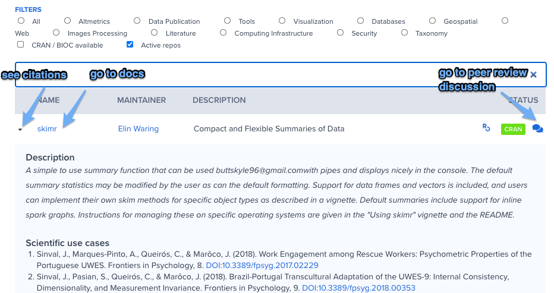

## Packages list {#packages}

The [Packages page](https://ropensci.org/packages/) on our website lists our carefully vetted, staff- and community-contributed R software tools. 
rOpenSci focuses on curating R packages which lower barriers to working with open scientific data sources for various research applications in an effort to support open and reproducible science. Of over 400 packages, about 30.0% have been peer reviewed, and more than half are on CRAN. In 2019, 117 people made their first-ever code contribution to rOpenSci!

You can discover packages by searching with a package name, name of the maintainer (maybe you’re a fan of their work (emoji)), or filter by category like “Taxonomy” or “Image Processing”. For any package, clicking on the package name takes you to its documentation. This docs page is where you can generally find information on making contributions from reporting bugs, to submitting feature requests or bug fixes. You can also find information on using the package from getting started, Articles and Vignettes. 

_Yes these annotations are ugly for now_

You can learn more about a package by reading blog posts and tech notes tagged with package names (like [tesseract](https://ropensci.org/tags/tesseract/) or [taxize](https://ropensci.org/tags/taxize/)). Browse the [tags page](https://ropensci.org/tags/). Find examples of how others used them by browsing the Uses Cases category of our public forum{internal link Use Cases}. Some of our Community Calls{LINK} focus on packages in a specific domain. [Check out our archive](https://ropensci.org/commcalls/) with videos of past calls. Looking for more examples? Ask in the forum{LINK} or tweet your question and tag [@rOpenSci](https://twitter.com/rOpenSci). 

While package maintainers have the ultimate say on package features, they are often eager to modify a package to accommodate real world use cases. If you have a particular feature request in mind, open an issue in the package repository with a succinct idea, and ideally a minimal reproducible example if code is applicable. Avoid emailing maintainers directly - it may be tempting but benefits no one else - keep discussions in the open when possible.

You can also help out by addressing issues (see the [Issues List](#issues)), or making pull requests to add features, fix bugs, add documentation, or add vignettes or articles. To do so, take a look at the project’s contributing guide, then open an issue to discuss your approach with the author. Create a pull request and submit your proposed solution!

Complicated, long running tutorials may not make it into the CRAN version, but can easily be accommodated in the package documentation site as an “Article” (see [https://pkgdown.r-lib.org/articles/pkgdown.html#articles-1](https://pkgdown.r-lib.org/articles/pkgdown.html#articles-1))

### How to contribute?

*   **Browse rOpenSci packages**
*   **Use rOpenSci  packages** (Yes, that is a contribution!)
*   **Tell your friends what you like about a package	**
*   **Browse citations of rOpenSci packages{Link to where?}** to find interesting applications
*   **Cite rOpenSci packages in manuscripts and presentations**{internal link or tech note link}. Manuscript citations will appear on our packages page.
*   **Encourage your colleagues to cite software**

> “Just learned that the webchem package was cited in a paper by a group of oncologists. It totally made my morning to think that my code might someday contribute a teensy tiny bit to better treatments for cancer.” [Eric Scott](https://twitter.com/LeafyEricScott/status/1273605411577442304) 

*   **Write a personal blog post about using rOpenSci packages**
*   **Report a bug**
*   **Make a pull request** to fix a typo or a bug, to add/fix examples, to add/clarify documentation, to add/update a citation file
*   **Make a feature request **on a package that’s critical for your work
*   **Review the documentation** and give feedback to the package author
*   **Write a vignette/article for a package**. Contact the package author to propose your idea and determine how they will review your contribution.