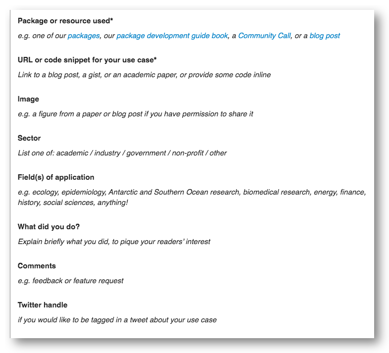

## Use cases {#usecases}

You can **find use cases** for rOpenSci packages and resources on our [rOpenSci Use Cases page](https://ropensci.org/usecases/) or in [our public forum UseCases category](https://discuss.ropensci.org/c/usecases/10). 

A “use case” here is a write-up of an example, including an explanation of what you did, some code, and where possible, an image showing an outcome. It might take the form of a code snippet, or a link to a blog post or to an analysis in a public repository. 

Many of these use cases include applications in academia, industry, government, or “just for fun” with examples on biodiversity, ecology, text processing, bibliometrics, workflows and reproducibility, weather, public health, bicycle networks, agronomy, epidemiology, surveys, seafood mislabelling, tweets about fires, and others! 

Some use cases outline examples of how resources like our [guide on package development, review and maintenance](#devguide) have been used independently of rOpenSci. Read more in our blog post, [What are Your Use Cases for rOpenSci Tools and Resources?](https://ropensci.org/blog/2019/10/15/use-cases/)

You can **search or sort by package, title or date** on the rOpenSci Use Cases page and **topics in the forum are tagged with the names of rOpenSci packages** they address. Clicking on a tag will show you all other posts in the forum that share that tag. You can also search with terms like “[weather](https://discuss.ropensci.org/search?q=weather%20category%3A10)” or “[doi](https://discuss.ropensci.org/search?q=doi%20category%3A10)” to find use cases in an area of application. 

We love it when people share their use cases. For so many reasons.

It’s valuable to both users and developers of a package to see how it has been used “in the wild”. This goes a long way to encouraging people to maintain their package knowing there are others who appreciate, use, and build on their work. This also helps people imagine how they might use a package to address their research question, and provides some code to give them a head-start.

Developers and users will thank you and you’ll get the credit and some visibility for your work!

### How to contribute

*   **Explore use cases** on the [rOpenSci Use Cases page](https://ropensci.org/usecases/) or in [our public forum UseCases category](https://discuss.ropensci.org/c/usecases/10). Comment on or [emoji heart] use cases that you find useful or inspiring. Consider tweeting or sharing to other platforms if you find them particularly helpful.
*   We’ve made it easy to **submit your use cases** for rOpenSci packages (including your own) or resources by creating a template to guide you. When you [post your use case in the forum](https://discuss.ropensci.org/c/usecases/10) we’ll tweet about it to rOpenSci’s ~30,000 followers, tagging you and the package or resource author, and we might feature it in our [newsletter](#channels).
*   **Encourage your peers to submit use cases**. Over time, these “small” actions are creating valuable open resources!

_Use case template_
